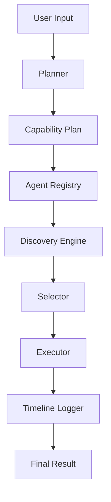

# 🧠 OmniMind OS — Agentic Capability-Based AI Operating System

## 🚀 Overview

OmniMind OS is a **multi-agent orchestration system** designed to simulate an AI operating system where tasks are dynamically resolved:

`User → Planner → Capability Plan → Agent Discovery → Agent Selection → Execution → Traceable Output`

---

## 🧩 Core Innovation

Unlike traditional AI pipelines, OmniMind introduces:

### 1. Capability-Based Planning
Instead of assigning fixed agents, tasks are broken into **capabilities** (e.g., "research", "code").

### 2. Agent Discovery Layer
Agents are dynamically discovered from multiple sources (simulated):
- Local runtime agents
- GitHub-based agents
- HuggingFace models
- MCP / API tools

### 3. Intelligent Agent Selection
Each capability is evaluated against user preferences using:
- Cost & License
- Score & Latency
- Installation status

### 4. Execution Timeline (Explainability Layer)
Every decision is traceable, producing a transparent execution story.

---

## 🏗 Architecture



---

## ⚙️ Features

- **Multi-agent orchestration:** Seamless delegation across tools and sub-agents.
- **Capability-based decomposition:** Abstract planning independent of specific agents.
- **Agent scoring & ranking:** Preference-based candidate selection.
- **Tool integration:** Git, API, and an MCP-ready stub layer.
- **Execution trace timeline:** Full auditability of system decisions.
- **Guardrails system:** Input validation and safety checks.

---

## 🧪 How to Run

### Prerequisites
- Python 3.9+
- `requests` library

### Installation

```bash
# Clone the repository (if applicable)
git clone https://github.com/rofen69/OmniMind-OS.git
cd OmniMind-OS

# Install dependencies
pip install -r requirements.txt
```

### Execution

```bash
python -m src.main
```

---

## 📊 Output Example

```text
🧠 OmniMind OS v1.0 — Agentic Capability-Based AI Operating System

📥 USER INPUT: "Research Quantum Computing and format it as a document then save the file"

🎯 EXECUTION PLAN
  Step 1: [research] → "Research Quantum Computing and format it as a document then save the file"
  Step 2: [documentation] → "Research Quantum Computing and format it as a document then save the file"
  Step 3: [file] → "Research Quantum Computing and format it as a document then save the file"

🔍 AGENT DISCOVERY
  Capability: research
=== Candidates for 'research' ===
name                | source      | installed | cost | license    | score | limitations               | requirements 
--------------------+-------------+-----------+------+------------+-------+---------------------------+--------------
LocalResearchAgent  | Local       | True      | Free | Internal   | 1.0   | ['Local only']            | []           
GitHubResearchAgent | GitHub      | False     | Free | MIT        | 0.93  | ['Requires installation'] | ['Internet'] 
HFResearchAgent     | HuggingFace | False     | Paid | Commercial | 0.97  | ['API cost']              | ['API Token']

  Capability: documentation
=== Candidates for 'documentation' ===
name               | source | installed | cost | license  | score | limitations       | requirements
-------------------+--------+-----------+------+----------+-------+-------------------+-------------
DocumentationAgent | Local  | True      | Free | Internal | 1.0   | ['Markdown only'] | []          

  Capability: file
=== Candidates for 'file' ===
name      | source | installed | cost | license  | score | limitations                | requirements
----------+--------+-----------+------+----------+-------+----------------------------+-------------
FileAgent | Local  | True      | Free | Internal | 1.0   | ['Local file system only'] | []          

⚡ AGENT SELECTION
  research → LocalResearchAgent (score: 1.0, source: Local) ✅
  documentation → DocumentationAgent (score: 1.0, source: Local) ✅
  file → FileAgent (score: 1.0, source: Local) ✅

📊 EXECUTION RESULTS
  Step 1: {'agent': 'LocalResearchAgent', 'task': '...', 'output': '# Research Summary: Quantum computing...'}
  Step 2: {'agent': 'DocumentationAgent', 'task': '...', 'output': 'Successfully formatted document and saved to memory...'}
  Step 3: {'agent': 'FileAgent', 'task': '...', 'output': 'Successfully saved to workspace/quantum_computing.md'}

📋 EXECUTION TIMELINE
  [1] research → LocalResearchAgent (Local) → executed ✅
  [2] documentation → DocumentationAgent (Local) → executed ✅
  [3] file → FileAgent (Local) → executed ✅

✅ Execution complete. 3 step(s) processed.
```

---

## 📚 Key Concepts Demonstrated (Kaggle Capstone)

- **Agent / Multi-agent system:** Capability-based dynamic routing to specialized agents.
- **Security features:** Guardrails system for input validation and safe fallback.
- **MCP Server (Simulated):** Tool manager designed to bridge to Model Context Protocol.

---

## 🧠 Developer Journey: From Coder to Orchestrator

I have been in app and game development since 2013, but I had never completed a desktop application of this scale. Previously, I experimented with automated AI code generators but found myself trapped in repetitive, unbreakable loops that led me to lose interest in AI development.

This course changed everything. Instead of asking AI to "write all the code," I learned to treat AI agents and tools (like the Antigravity IDE and ADK) as a complete engineering team where **I act as the manager and architect**. My role shifted from writing every line of code manually to designing the system architecture, decomposing the problems, validating outputs, and making the final engineering decisions. 

OmniMind OS is the realization of this philosophy. It is not just a capstone project; it represents my transition from a coder to an orchestrator of intelligent systems.

---

## 📜 License

This project is licensed under the CC-BY 4.0 License - see the [LICENSE](LICENSE) file for details.