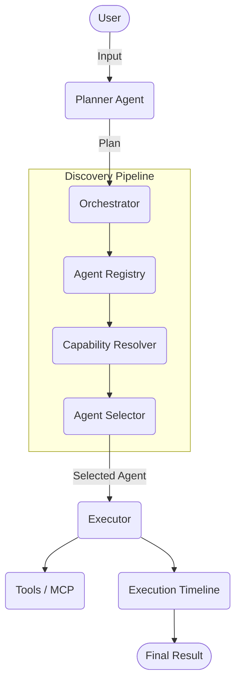

# OmniMind OS – Development Roadmap

> **Mission:** Build a modular, secure, extensible Agent Operating System that demonstrates modern AI Agent Engineering using Google's AI Agent concepts, ADK, MCP, Antigravity, Security, Evaluation, and Deployability for the Kaggle AI Agents Capstone Project.

---

# Current Focus

**Current Phase:** Phase A – Submission-Safe MVP

**Current Sprint:** Sprint 7 – Submission

**Current Task:** YouTube Demo Video & Kaggle Writeup

**Project Health:** 🟢 On Track

**Current Progress:** 90%

---

# Development Principles

The project follows these engineering principles:

- Planner-first architecture
- Modular agent ecosystem
- Security by design
- Local-first whenever possible
- Human approval for sensitive actions
- Transparent execution timeline
- Extensible through MCP
- One component = One responsibility
- One commit = One capability
- Documentation and implementation remain synchronized

---

# Phase A – Submission-Safe MVP

## Sprint 1 – Foundation ✅

- [x] Git repository initialized
- [x] Repository structure created
- [x] Project Charter completed
- [x] Product Specification (foundation)
- [x] System Architecture (foundation)
- [x] Engineering folder structure
- [x] Shared domain models
- [x] BaseAgent interface

---

## Sprint 2 – Core Framework ✅

- [x] Agent Registry
- [x] Planner Agent
- [x] Task Orchestrator
- [x] Execution Pipeline
- [x] Shared Configuration
- [x] Logging Framework

---

## Sprint 3 – Security & Integration ✅

- [x] Guardrail Manager
- [x] Permission System (Stubbed)
- [x] MCP Registry (Stubbed)
- [x] MCP Client (Stubbed)
- [x] Tool Discovery
- [x] Error Recovery (Fallback routing)

---

## Sprint 4 – Built-in Agents ✅

- [x] File Agent (Stubbed)
- [x] Documentation Agent (Stubbed)
- [x] Research Agent
- [x] Evaluation Agent

---

## Sprint 5 – User Experience ✅

- [x] Command Line Interface (CLI)
- [x] Execution Timeline
- [x] Task Monitor (UI formatting)
- [x] Configuration Manager (User Preferences)

---

## Sprint 6 – Competition Requirements ✅

- [x] Demonstrate ADK concepts (Adapter stub)
- [x] Demonstrate MCP integration (Tool fallback)
- [x] Demonstrate Security (Guardrails)
- [x] Demonstrate Evaluation (Evaluation Agent)
- [x] Demonstrate Deployability (requirements.txt)
- [x] Complete Documentation (Architecture diagrams)

---

## Sprint 7 – Submission (In Progress)

- [x] Complete README
- [x] Architecture diagrams
- [ ] Screenshots / Cover Image
- [ ] Demo video
- [x] GitHub cleanup
- [ ] Kaggle Writeup
- [ ] Final submission

---

# Competition Checklist

| Requirement | Status |
|-------------|--------|
| Multi-Agent Architecture | ✅ |
| ADK Concepts | ✅ |
| MCP | ✅ |
| Security | ✅ |
| Evaluation | ✅ |
| Deployability | ✅ |
| Public GitHub | ✅ |
| Documentation | ✅ |
| Video | ⏳ |
| Kaggle Writeup | ⏳ |

---

# Core Architecture (Frozen)

---

# Future Versions (After Competition)

## Version 2

- Integration with real LLMs for dynamic planning
- Adaptive Workspace UI
- Agent Marketplace

## Version 3

- Federated Multi-Agent Collaboration
- Distributed Execution
- Autonomous Workspace Optimization