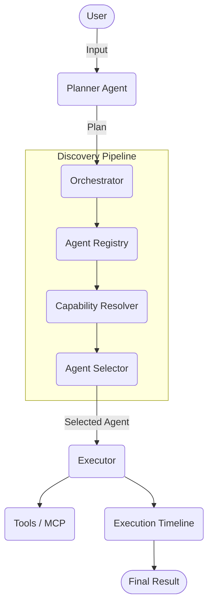

# OmniMind OS – System Architecture

## 1. Architecture Philosophy

OmniMind OS follows a Planner-first, modular architecture. Every user request is interpreted by a central Planner Agent that coordinates specialized agents, tools, and external services to complete the requested objective.

The core system remains lightweight, secure, and extensible. New agents can be installed, updated, or removed without modifying the core Planner or operating environment.

---

## 2. High-Level Architecture



---

## 3. Core Components

The Version 1 architecture consists of:

- Planner Agent
- Agent Registry
- Built-in Agent Manager
- MCP Registry
- Guardrail Manager
- Execution Timeline
- Evaluation Module
- Local Storage Manager

Each component has a single responsibility and communicates through well-defined interfaces.

---

## 4. Planner Layer

The Planner Agent is the operating system's decision engine.
Its responsibilities include:
- Understanding user intent.
- Breaking goals into executable tasks.
- Building an execution plan.

The Planner never performs domain-specific work directly. Instead, it orchestrates specialized agents capable of completing individual tasks.

---

## 5. Agent Layer

Agents implement the `BaseAgent` interface. They wrap domain-specific logic ("skills") and are dynamically invoked by the Orchestrator. 

---

## 6. Tool Layer

The `ToolManager` coordinates execution of functional tools (e.g., Git, API requests). The Orchestrator routes tasks to tools using a `tool:` capability prefix.

---

## 7. MCP Layer

Model Context Protocol (MCP) support is provided via an `MCPClient` stub. When a requested tool is not found locally, the ToolManager safely falls back to querying the MCP network.

---

## 8. Security Layer

The `Guardrails` module intercepts user input before planning to enforce length constraints, sanitization, and safety checks, preventing prompt injection or malicious resource exhaustion.

---

## 9. Memory Layer

`Memory` and `SessionMemory` provide temporary state storage during execution runs. Memory instances can be injected into agents by the Registry to share context.

---

## 10. Execution Flow

1. Input → Guardrails
2. Planner → Capability sequence
3. For each capability:
   - Registry → Resolver → Metadata Candidates
   - Selector → User Preference Filtering → Best Agent
   - Execute Agent/Tool
4. Compile Timeline + Results → Return to User

---

## 11. Folder Structure

```text
src/
├── agents/       # Domain-specific agents and their skills
├── core/         # Orchestrator, Planner, Registry, Guardrails
├── discovery/    # Catalog, Resolver, Selector
├── integrations/ # ADK wrappers and third-party adapters
├── mcp/          # Model Context Protocol clients
├── memory/       # State and session management
├── security/     # Future RBAC and policy modules (MVP runtime security is in core/guardrails.py)
├── shared/       # Dataclasses, types, preferences
└── ui/           # CLI renderers and presentation layer
```